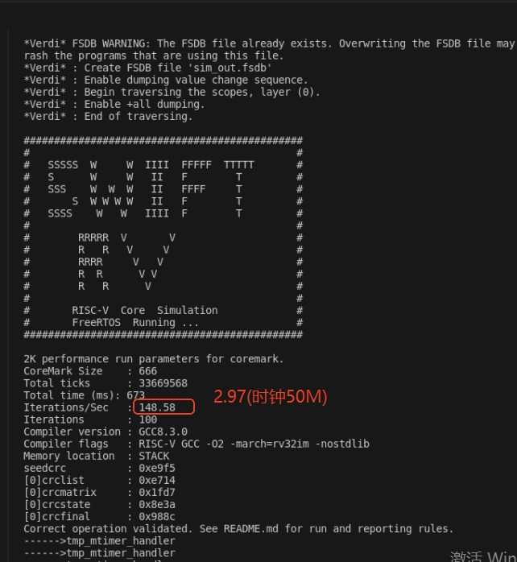
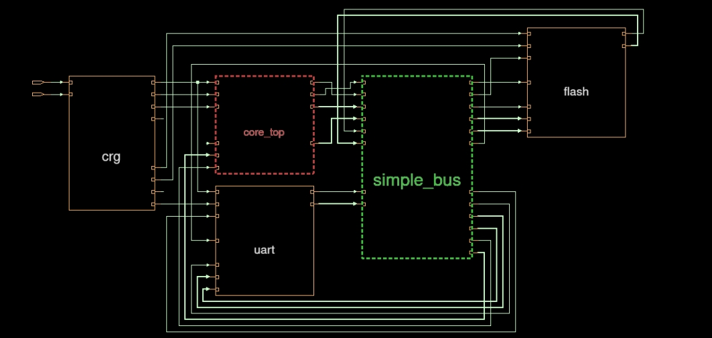
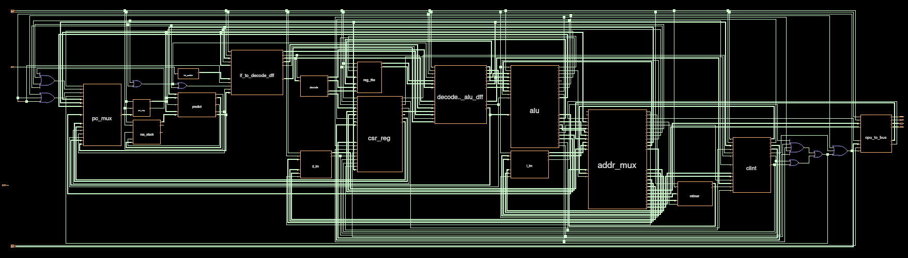

<!--
 * @Author: pythonkd 1181878670@qq.com
 * @Date: 2026-07-12 16:09:51
 * @LastEditors: pythonkd 1181878670@qq.com
 * @LastEditTime: 2026-08-09 21:24:55
 * @FilePath: /swift_riscv/README.md
 * @Description: 
 * 
 * Copyright (c) 2026 by  kunpeng.zhao, All Rights Reserved. 
-->
# SwiftRiscv
# 核心架构特性
## 1. 三级流水线架构
采用经典 **取指（Fetch）- 译码（Decode）- 执行（Execute）** 三级流水线设计：

- 流水线级数短，硬件实现复杂度低，时序收敛容易
- 内置数据旁路（Forwarding）机制，降低数据冒险导致的流水线停顿
- 单周期完成基础整数运算，整体执行效率均衡
## 2. 静态分支预测
## 3. RAS 返回地址栈
## 4. 8KB 片上紧耦合存储器
## 5. 指令集扩展支持
完整兼容 RISC-V 标准指令集扩展：

- **I 扩展**：基础整数指令集，支持加减、移位、比较、逻辑运算等通用操作
- **M 扩展**：整数乘除指令集，支持硬件乘法、除法、取余运算，提升数值计算效率
## 6. 中断与异常处理
支持完整的 RISC-V 机器模式异常与中断体系：

- **异常处理**：可捕获非法指令、地址未对齐、访问越界等异常事件，支持标准异常入口与返回流程
- **中断处理**：支持外部中断源接入，具备中断使能、优先级响应与现场保护恢复能力
## 7. 标准机器定时器 mtimer
集成 RISC-V 规范定义的 **mtimer 机器定时器**：

- 提供自由运行的 64 位计时计数器与比较寄存器
- 可产生机器模式定时中断，常用于操作系统时钟节拍、任务延时、超时检测等场景

## 执行方法

## 1. source script/project.sh

## 2. cd verification/sim

## 3. make run_freertos

## COREMARK

## 架构

