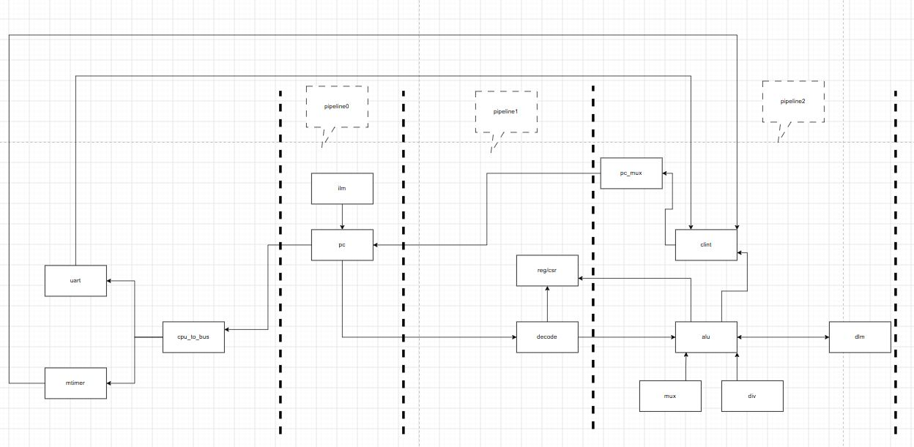

<!--
 * @Author: pythonkd 1181878670@qq.com
 * @Date: 2026-07-12 16:09:51
 * @LastEditors: pythonkd 1181878670@qq.com
 * @LastEditTime: 2026-08-09 21:24:55
 * @FilePath: /swift_riscv/README.md
 * @Description: 
 * 
 * Copyright (c) 2026 by  kunpeng.zhao, All Rights Reserved. 
-->
# SwiftRiscv

## 三级流水线，riscv架构

## 执行方法

## 1. source script/project.sh

## 2. cd verification/sim

## 3. make run

